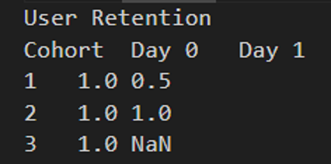

# 📊 Cohort Analysis & Retention (Pandas Project)

## 🎯 Project Goal
Analyze user behavior after their first interaction and measure retention and revenue dynamics over time.

---

## 📁 Dataset

The dataset contains:

- user — user identifier  
- day — day of activity  
- revenue — revenue generated by the user  

---

## 🧠 Problem

We want to answer:

- How many users return after their first visit?
- How does revenue change over time?
- Do fewer users always mean less revenue?

---

## 🔍 Approach

### 1. Define Cohorts

Each user is assigned to a cohort based on their first activity day:

cohort = df.groupby('user')['day'].min()

### 2. Calculate Relative Time
df['day_number'] = df['day'] - df['cohort']

This aligns all users relative to their starting point.

### 3. User Retention
users = df.groupby(['cohort', 'day_number'])['user'] \
    .nunique().reset_index()
    
### 4. Pivot Table
pivot = users.pivot(
    index='cohort',
    columns='day_number',
    values='user'
)
### 5. Normalize (Retention)
retention = pivot.div(pivot[0], axis=0)

### 📊 Results
User Retention
Cohort	Day 0	Day 1
1	1.0	0.5
2	1.0	1.0
3	1.0	NaN



### 💰 Revenue Retention
Revenue retention may exceed 1.0:

Remaining users can generate more revenue than at the start.

### 🔥 Key Insights
Retention must be calculated relative to user start, not absolute days
Different cohorts have different timelines
Revenue retention can grow even when user count declines

###🧠 What I Learned
How to perform cohort analysis in Pandas
How to use groupby, pivot, and broadcasting
The difference between user retention and revenue retention
How to think in terms of product analytics

### 🚀 Next Steps
SQL version of the same analysis
Visualization (heatmap cohort table)
Apply to real-world datasets

### 🛠 Tech Stack
Python
Pandas

```python
 